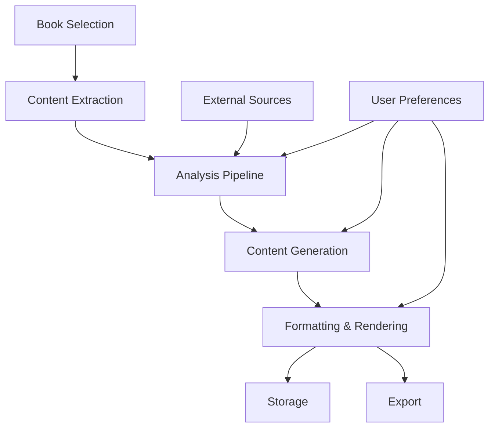

# Meta Book Feature - Design Document

## Overview

The Meta Book feature will generate comprehensive, AI-powered companion books that provide in-depth analysis and insights about books in the user's library. These "meta books" will serve as valuable literary companions, offering deeper understanding and context for both individual books and thematic collections.

## Core Features

### 1. Book Analysis Generation
- **Comprehensive Book Dossiers**
  - Plot summaries at different levels of detail
  - Character analyses and relationship maps
  - Thematic exploration and motif identification
  - Writing style and narrative structure analysis
  - Historical and cultural context

### 2. Thematic Collections
- **Cross-Book Analysis**
  - Compare and contrast related works
  - Identify common themes across an author's works
  - Track character archetypes and development
  - Analyze genre conventions and innovations

### 3. Multi-Source Integration
- **Content Aggregation**
  - Import and synthesize public reviews
  - Integrate literary criticism and analysis
  - Include author interviews and commentary
  - Reference academic papers and articles

### 4. Customizable Output
- **Content Customization**
  - Adjust depth and focus areas
  - Include/exclude specific sections
  - Choose analysis style (academic, casual, etc.)
  - Select target audience (student, scholar, casual reader)

### 5. Export & Integration
- **Multiple Formats**
  - Generate as EPUB, PDF, or Markdown
  - Interactive web view with navigation
  - Integration with reading progress
  - Shareable links and embeds

## Technical Architecture

### 1. System Components

#### 1.1 Meta Book Generator
- **Analysis Engine**: Processes book content and metadata
- **AI Integration**: Interfaces with LLM services
- **Content Aggregator**: Fetches external sources
- **Renderer**: Formats output in various formats

#### 1.2 Data Sources
- Local book content and metadata
- Komga's existing database
- External APIs (Goodreads, Open Library, etc.)
- Web scraping (where appropriate)
- User-provided content

#### 1.3 Storage
- Generated meta books storage
- Cached analysis results
- User preferences and templates

### 2. Data Flow



## API Design

### Endpoints

#### 1. Meta Book Generation
```http
POST /api/v1/meta-books/generate
Content-Type: application/json

{
  "bookIds": ["book-123", "book-456"],
  "type": "individual|comparative|thematic",
  "options": {
    "depth": "brief|standard|comprehensive",
    "sections": ["summary", "characters", "themes", "style"],
    "sources": {
      "includeExternal": true,
      "includeUserContent": true
    },
    "format": "epub|pdf|markdown|web"
  },
  "callbackUrl": "https://example.com/callback"
}
```

#### 2. Get Meta Book Status
```http
GET /api/v1/meta-books/{id}/status
```

#### 3. Download Meta Book
```http
GET /api/v1/meta-books/{id}/download
Accept: application/epub+zip|application/pdf|text/markdown
```

#### 4. List Generated Meta Books
```http
GET /api/v1/meta-books?bookId={bookId}&type={type}
```

## Data Models

### 1. Meta Book
```kotlin
data class MetaBook(
    val id: String,
    val bookIds: List<String>,
    val type: MetaBookType,
    val status: GenerationStatus,
    val createdAt: Instant,
    val updatedAt: Instant,
    val metadata: MetaBookMetadata,
    val format: OutputFormat,
    val storagePath: String?,
    val error: String? = null
)

enum class MetaBookType {
    INDIVIDUAL,
    COMPARATIVE,
    THEMATIC
}

enum class GenerationStatus {
    PENDING,
    PROCESSING,
    COMPLETED,
    FAILED
}

data class MetaBookMetadata(
    val title: String,
    val description: String,
    val coverImage: String?,
    val wordCount: Int,
    val sectionCount: Int,
    val generatedAt: Instant,
    val options: GenerationOptions
)
```

## User Interface

### 1. Generation Interface
- Book selection with preview
- Options panel for customization
- Progress indicators
- Notification when complete

### 2. Library Integration
- Meta books appear alongside originals
- Visual indicators for available meta books
- Quick access to generation options

### 3. Reading Experience
- Interactive table of contents
- Cross-referenced content
- Citation and reference tools
- Note-taking capabilities

## Implementation Phases

### Phase 1: Core Functionality
- Basic text analysis and generation
- Simple EPUB output
- Single-book analysis
- Basic UI for generation

### Phase 2: Enhanced Analysis
- Thematic and comparative analysis
- External source integration
- Multiple output formats
- Batch processing

### Phase 3: Advanced Features
- Interactive elements
- User annotations and contributions
- Sharing and collaboration
- Advanced customization

## Performance Considerations

1. **Caching**
   - Cache analysis results
   - Store generated content efficiently
   - Implement TTL for cached items

2. **Background Processing**
   - Use job queues for generation
   - Support cancellation and resumption
   - Progress tracking

3. **Resource Management**
   - Limit concurrent generations
   - Implement rate limiting
   - Clean up temporary files

## Security & Privacy

1. **Data Handling**
   - Process sensitive data securely
   - Implement access controls
   - Log access and modifications

2. **External Services**
   - Secure API key management
   - Data minimization
   - Compliance with terms of service

3. **User Content**
   - Clear data ownership policies
   - Export/delete capabilities
   - Privacy controls

## Future Enhancements

1. **Collaborative Features**
   - Shared annotations
   - Community contributions
   - Discussion threads

2. **Advanced AI**
   - Custom model fine-tuning
   - Domain-specific analysis
   - Multilingual support

3. **Integration**
   - Note-taking apps
   - Academic reference managers
   - Social reading platforms
