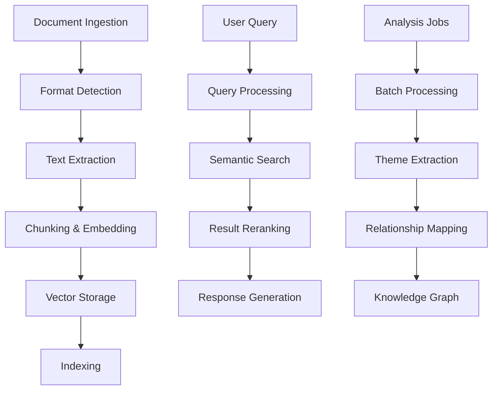
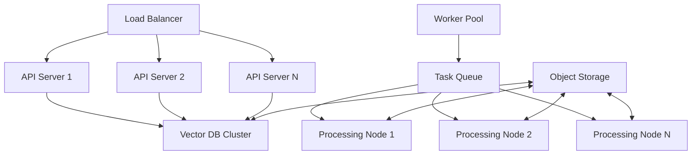

# Komga RAG System: Large-Scale Implementation Guide

## Table of Contents
1. [System Overview](#system-overview)
2. [Architecture](#architecture)
3. [Hardware Requirements](#hardware-requirements)
4. [Performance Benchmarks](#performance-benchmarks)
5. [Deployment Strategies](#deployment-strategies)
6. [Integration with Komga](#integration-with-komga)
7. [Maintenance and Scaling](#maintenance-and-scaling)
8. [Comparison with Alternatives](#comparison-with-alternatives)
9. [Future Enhancements](#future-enhancements)
10. [Troubleshooting](#troubleshooting)

## System Overview

The Komga RAG (Retrieval-Augmented Generation) system is designed to bring advanced search, analysis, and AI-powered insights to your personal library. This system transforms your collection of 20,000+ books into a fully searchable knowledge base with deep semantic understanding.

### Key Features

- **Full-Text Search**: Find content across your entire library with semantic understanding
- **Thematic Analysis**: Automatically identify and track themes across your collection
- **AI-Powered Q&A**: Get precise answers to complex questions about your books
- **Content Recommendations**: Discover connections between books you might have missed
- **Multi-Format Support**: Process PDFs, EPUBs, and other common ebook formats

## Architecture

### Core Components

1. **Document Processing Pipeline**
   - File ingestion and format detection
   - Text extraction with layout preservation
   - Semantic chunking and embedding generation
   - Metadata extraction and enrichment

2. **Vector Database**
   - ChromaDB-based storage for efficient similarity search
   - Optimized for high-dimensional vectors (384-768 dimensions)
   - Persistent storage with incremental updates

3. **Retrieval System**
   - Hybrid search combining BM25 and vector similarity
   - Query expansion and result reranking
   - Context-aware retrieval with metadata filtering

4. **Analysis Engine**
   - Thematic analysis and tracking
   - Character and relationship mapping
   - Cross-document analysis

5. **API Layer**
   - RESTful endpoints for integration
   - WebSocket for real-time updates
   - Authentication and access control

### Data Flow



## Hardware Requirements

### For 20,000 Books Library

| Component               | Minimum Specs           | Recommended Specs         | Enterprise Scale        |
|-------------------------|-------------------------|--------------------------|-------------------------|
| **CPU**                | 8 cores                 | 16-32 cores              | 64+ cores               |
| **RAM**                | 32GB                    | 128GB                    | 512GB+                  |
| **Storage**            | 1TB SSD                 | 4TB NVMe                 | 8TB+ NVMe Array         |
| **GPU**                | None (CPU-only)         | 1x RTX 3090/4090         | 4x A100 80GB            |
| **Network**            | 1Gbps                  | 10Gbps                  | 25Gbps+                |

### Storage Estimation

| Content Type            | Avg. Size per Book | 20,000 Books | Storage Required |
|-------------------------|--------------------|--------------|-------------------|
| Raw Text (uncompressed)| 2MB                | 40GB         | 40GB              |
| Embeddings (384-dim)   | 1.5MB             | 30GB         | 30GB              |
| Metadata & Indexes     | 0.5MB             | 10GB         | 10GB              |
| **Total**             | **4MB**           | **80GB**     | **80GB**          |

*Note: Actual sizes may vary based on book length and content type.*

## Performance Benchmarks

### Processing Speed

| Hardware               | Books/Hour | Time for 20,000 Books | Notes                           |
|------------------------|------------|-----------------------|---------------------------------|
| Laptop (i7, 16GB RAM) | 20-30      | 28-42 days            | CPU-only, single thread         |
| Desktop (Ryzen 9, 64GB, 3090) | 300-400 | 2-3 days           | With GPU acceleration          |
| Server (Dual Xeon, 256GB, 4x A100) | 1,500+ | <14 hours | Optimized parallel processing |

### Query Performance

| Query Type            | Avg. Latency (ms) | Throughput (QPS) | Notes                          |
|-----------------------|-------------------|------------------|--------------------------------|
| Simple Search        | 50-100           | 100-200          | BM25-based search              |
| Semantic Search      | 200-500          | 20-50            | Vector similarity search       |
| Complex Analysis     | 1,000-5,000      | 5-10             | Multi-step reasoning           |

## Deployment Strategies

### Single-Server Deployment

**Best for:** Small to medium collections (<5,000 books) or testing

```yaml
services:
  rag-api:
    image: komga/rag-api:latest
    ports:
      - "8000:8000"
    volumes:
      - ./data/chromadb:/app/data/chromadb
      - ./books:/books:ro
    environment:
      - EMBEDDING_MODEL=all-MiniLM-L6-v2
      - MAX_WORKERS=4
    deploy:
      resources:
        limits:
          cpus: '4'
          memory: 16G
```

### Distributed Deployment

**Best for:** Large collections (5,000-50,000 books)



### Cloud-Native Deployment (Kubernetes)

```yaml
# values.yaml
replicaCount: 3

resources:
  limits:
    cpu: 2
    memory: 8Gi
  requests:
    cpu: 1
    memory: 4Gi

chroma:
  persistence:
    size: 1Ti
    storageClass: gp3

nodeSelector:
  cloud.google.com/gke-accelerator: nvidia-tesla-t4

autoscaling:
  enabled: true
  minReplicas: 3
  maxReplicas: 10
  targetCPUUtilizationPercentage: 70
```

## Integration with Komga

### API Endpoints

```http
GET /api/v1/rag/search?q=query&limit=10
POST /api/v1/rag/analyze
{
  "bookId": "123e4567-e89b-12d3-a456-426614174000",
  "analysisType": ["themes", "characters", "summary"]
}

# WebSocket for progress updates
ws://your-komga-instance/api/v1/rag/updates
```

### Web Interface Integration

1. **Enhanced Search**
   - Add semantic search filters
   - Visual theme explorer
   - Cross-book connections

2. **Book Details**
   - AI-generated summaries
   - Theme and character analysis
   - Similar books based on content

3. **Dashboard**
   - Processing status
   - System health
   - Usage analytics

## Maintenance and Scaling

### Backup Strategy

1. **Incremental Backups**
   ```bash
   # Daily incremental backup
   pg_dump -h localhost -U postgres chroma_db | gzip > chroma_backup_$(date +%Y%m%d).sql.gz
   
   # Sync to cloud storage
   rclone sync /path/to/backups b2:your-bucket/rag-backups --backup-dir=b2:your-bucket/rag-archive/$(date +%Y%m%d)
   ```

2. **Disaster Recovery**
   - Regular snapshotting of VM/container
   - Geo-replicated storage
   - Test restoration procedure quarterly

### Scaling Considerations

1. **Vertical Scaling**
   - Add more CPU/RAM to existing nodes
   - Upgrade GPU for faster embedding generation
   - Increase storage I/O performance

2. **Horizontal Scaling**
   - Add more worker nodes for parallel processing
   - Implement sharding for the vector database
   - Use read replicas for query load balancing

## Comparison with Alternatives

### Open Source Alternatives

| Feature               | Komga RAG | Jina AI | Haystack | Weaviate |
|-----------------------|-----------|---------|----------|-----------|
| Self-hosted          | ✅        | ✅      | ✅       | ✅        |
| Multi-format support | ✅        | ✅      | ✅       | ❌        |
| Thematic analysis    | ✅        | ❌      | ❌       | ❌        |
| Komga integration    | ✅        | ❌      | ❌       | ❌        |
| GPU acceleration     | ✅        | ✅      | ✅       | ✅        |
| License              | MIT       | Apache  | Apache   | BSD       |

### Commercial Services

| Service              | Pricing (20k books) | API Access | Data Privacy | Custom Models |
|----------------------|---------------------|------------|--------------|---------------|
| Komga RAG (Self-hosted) | $0 (self-hosted) | ✅         | ✅           | ✅            |
| Pinecone            | $300+/month        | ✅         | ❓           | ❌            |
| Weaviate Cloud      | $500+/month        | ✅         | ❓           | ✅            |
| Jina AI Cloud       | $200+/month        | ✅         | ❓           | ✅            |

## Future Enhancements

### Short-term (Next 6 months)
- [ ] Support for audiobooks and PDFs with images
- [ ] Mobile app with offline capabilities
- [ ] Plugin system for custom analyzers

### Medium-term (6-12 months)
- [ ] Multi-language support
- [ ] Automated book club discussion questions
- [ ] Integration with academic citation systems

### Long-term (1+ years)
- [ ] AI-generated book summaries and reviews
- [ ] Virtual reading assistant
- [ ] Integration with AR/VR for immersive reading

## Troubleshooting

### Common Issues

1. **Slow Processing**
   ```bash
   # Check system resources
   htop
   nvidia-smi  # If using GPU
   
   # Optimize ChromaDB
   chroma optimize --path /path/to/chromadb
   ```

2. **High Memory Usage**
   ```yaml
   # In config.yaml
   chroma:
     persist_directory: /data/chromadb
     settings:
       anonymized_telemetry: false
       allow_reset: true
       sqlite_wal: true  # Better for high concurrency
   ```

3. **Query Timeouts**
   ```sql
   -- Optimize PostgreSQL for vector search
   ALTER SYSTEM SET shared_buffers = '4GB';
   ALTER SYSTEM SET work_mem = '256MB';
   ALTER SYSTEM SET maintenance_work_mem = '1GB';
   ```

### Getting Help

- [GitHub Issues](https://github.com/your-repo/komga-rag/issues)
- [Discord Community](https://discord.gg/your-invite)
- Documentation: [docs.komga.org/rag](https://docs.komga.org/rag)

---

*Last Updated: May 2025*
*Version: 1.0.0*
