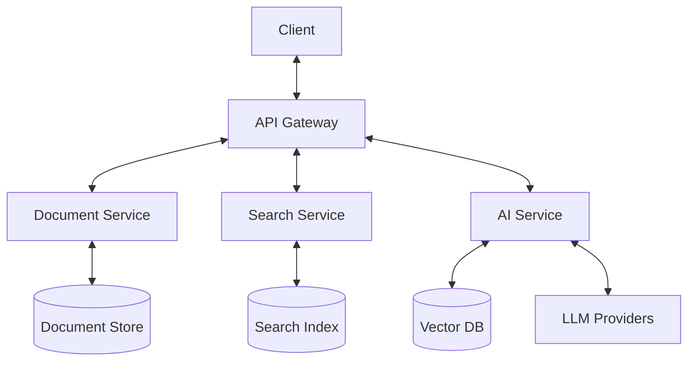

# Document Tool Technical Specification

## Table of Contents
1. [Architecture](#architecture)
2. [Components](#components)
3. [Data Model](#data-model)
4. [API Endpoints](#api-endpoints)
5. [UI/UX Specifications](#uiux-specifications)
6. [Integration Points](#integration-points)
7. [Performance Considerations](#performance-considerations)
8. [Security Model](#security-model)
9. [Migration Strategy](#migration-strategy)

## Architecture

### High-Level Overview


### Technology Stack
- **Frontend**: React + TypeScript
- **Backend**: Kotlin/Spring Boot
- **Database**: PostgreSQL + pgvector
- **Search**: Elasticsearch
- **AI**: Python FastAPI service
- **Storage**: S3-compatible storage

## Components

### 1. Document Service
- **Document CRUD**
- **Versioning**
- **Permissions**
- **Export/Import**

### 2. Search Service
- **Full-text search**
- **Semantic search**
- **Faceted search**
- **Auto-complete**

### 3. AI Service
- **Document processing**
- **Content analysis**
- **Tag suggestions**
- **Summarization**

## Data Model

### Document
```typescript
interface Document {
  id: string;
  title: string;
  content: string;
  type: 'markdown' | 'pdf' | 'html' | 'text';
  metadata: {
    author?: string;
    created: Date;
    modified: Date;
    tags: string[];
    starred: boolean;
    color?: string;
  };
  versions: DocumentVersion[];
  permissions: Permission[];
  parentId?: string;
  children: string[];
}

interface DocumentVersion {
  id: string;
  content: string;
  timestamp: Date;
  author: string;
  message?: string;
}
```

## API Endpoints

### Documents
- `GET /api/documents` - List documents
- `POST /api/documents` - Create document
- `GET /api/documents/{id}` - Get document
- `PUT /api/documents/{id}` - Update document
- `DELETE /api/documents/{id}` - Delete document

### Search
- `GET /api/search` - Search documents
- `GET /api/search/suggest` - Get search suggestions

### AI
- `POST /api/ai/summarize` - Generate summary
- `POST /api/ai/tags` - Suggest tags
- `POST /api/ai/analyze` - Analyze document

## UI/UX Specifications

### Tree View
- **Hierarchical display**
- **Drag and drop**
- **Context menu**
- **Bulk operations**

### List View
- **Column customization**
- **Sorting/filtering**
- **Grouping**
- **Quick actions**

### Editor
- **WYSIWYG and markdown**
- **Real-time collaboration**
- **Version history**
- **Comments/annotations**

## Integration Points

### Komga++
- **Shared authentication**
- **Unified search**
- **Common components**
- **Consistent theming**

### AI Teams
- **Bob**: Code generation
- **Alice**: Content analysis
- **Shared knowledge base**

## Performance Considerations

### Caching
- **Document content**
- **Search results**
- **AI responses**

### Indexing
- **Incremental updates**
- **Background processing**
- **Batch operations**

### Scaling
- **Sharding**
- **Read replicas**
- **CDN for assets**

## Security Model

### Authentication
- OAuth 2.0
- API keys
- Session management

### Authorization
- Role-based access control
- Document-level permissions
- Audit logging

### Data Protection
- Encryption at rest
- Encryption in transit
- Backup/restore

## Migration Strategy

### Phase 1: Preparation
1. Audit existing documents
2. Clean up duplicates
3. Standardize formats

### Phase 2: Migration
1. Set up new infrastructure
2. Migrate documents in batches
3. Verify integrity

### Phase 3: Cutover
1. Read-only mode
2. Final sync
3. Switch to new system

### Phase 4: Cleanup
1. Archive old data
2. Update documentation
3. Train users
