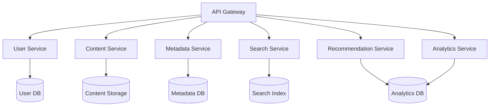
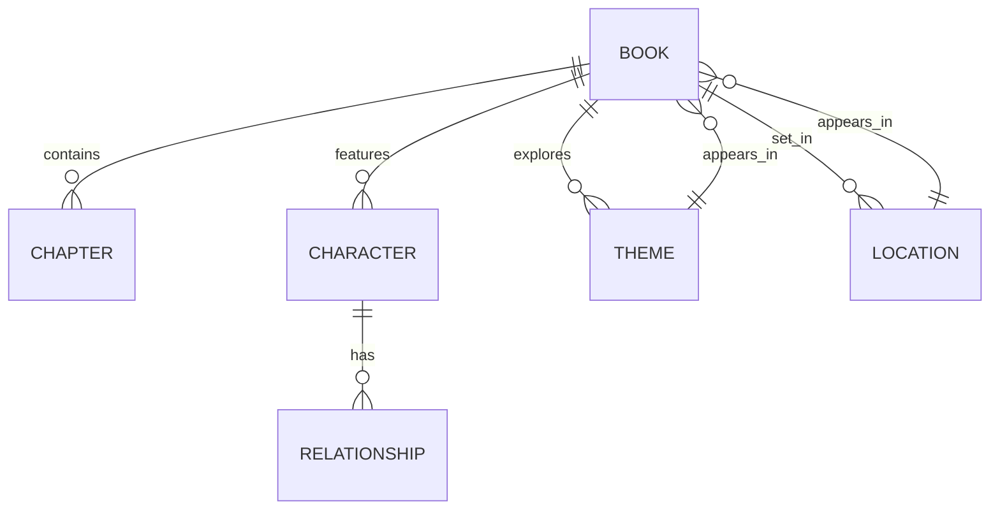

# Komga: Future Improvements Analysis

## Table of Contents
1. [Executive Summary](#executive-summary)
2. [AI & Machine Learning Integration](#ai--machine-learning-integration)
3. [Enhanced User Experience](#enhanced-user-experience)
4. [Technical Architecture](#technical-architecture)
5. [Content Discovery & Management](#content-discovery--management)
6. [Social & Community Features](#social--community-features)
7. [Accessibility & Inclusivity](#accessibility--inclusivity)
8. [Ecosystem Integration](#ecosystem-integration)
9. [Monetization & Sustainability](#monetization--sustainability)
10. [Implementation Roadmap](#implementation-roadmap)
11. [Risk Analysis](#risk-analysis)
12. [Conclusion](#conclusion)

## Executive Summary

This document outlines a strategic vision for transforming Komga into the premier self-hosted digital media platform for books and comics. By leveraging cutting-edge technologies and focusing on user-centric design, we can create a platform that not only meets but exceeds user expectations in the digital reading space.

## AI & Machine Learning Integration

### 1. Intelligent Metadata Enhancement

#### 1.1 Automatic Metadata Extraction
```python
class MetadataEnhancementPipeline:
    def __init__(self):
        self.nlp = spacy.load("en_core_web_trf")
        self.ocr = PaddleOCR(use_angle_cls=True, lang='en')
        self.vision_model = VisionEncoderDecoderModel.from_pretrained("nlpconnect/vit-gpt2-image-captioning")
    
    def process_content(self, file_path, existing_metadata):
        # Extract text from various formats
        text_content = self._extract_text(file_path)
        
        # Analyze cover and internal images
        visual_metadata = self._analyze_images(file_path)
        
        # Extract entities and relationships
        doc = self.nlp(text_content)
        entities = self._extract_entities(doc)
        
        # Generate summary and tags
        summary = self._generate_summary(text_content)
        tags = self._generate_tags(text_content, visual_metadata)
        
        return {
            **existing_metadata,
            'ai_summary': summary,
            'entities': entities,
            'visual_analysis': visual_metadata,
            'tags': tags,
            'last_processed': datetime.utcnow().isoformat()
        }
```

#### 1.2 Content Understanding
- **Thematic Analysis**: Identify themes and motifs in content
- **Content Classification**: Auto-categorize by genre, mood, and style
- **Content Warnings**: Detect and flag sensitive content

### 2. Advanced Recommendation Systems

#### 2.1 Hybrid Recommendation Engine
```python
class HybridRecommender:
    def __init__(self):
        self.collaborative_filter = CollaborativeFilter()
        self.content_based = ContentBasedRecommender()
        self.context_analyzer = ContextAnalyzer()
        
    def get_recommendations(self, user_id, content_id, context=None):
        # Combine multiple recommendation strategies
        cf_recs = self.collaborative_filter.get_recommendations(user_id)
        cb_recs = self.content_based.get_similar(content_id)
        
        # Apply contextual filtering
        context_features = self.context_analyzer.analyze(context)
        
        # Ensemble learning to combine recommendations
        recommendations = self._ensemble_models(cf_recs, cb_recs, context_features)
        
        return self._diversify(recommendations)
```

#### 2.2 Reading Behavior Analysis
- **Reading Speed Analysis**: Predict reading time
- **Engagement Metrics**: Track deep reading vs. skimming
- **Retention Analysis**: Identify engaging vs. challenging sections

## Enhanced User Experience

### 1. Reading Experience

#### 1.1 Adaptive Reading Interface
```typescript
interface ReadingPreferences {
  fontSize: number;
  lineHeight: number;
  margin: number;
  fontFamily: string;
  theme: 'light' | 'dark' | 'sepia' | 'solarized';
  autoScrollSpeed: number | null;
  textAlign: 'left' | 'right' | 'justify' | 'center';
  hyphenation: boolean;
  paragraphSpacing: number;
  brightness: number;
  contrast: number;
  // Accessibility features
  dyslexiaFont: boolean;
  lineFocus: boolean;
  textToSpeech: {
    enabled: boolean;
    voice: string;
    speed: number;
    highlightWords: boolean;
  };
}
```

#### 1.2 Interactive Elements
- **Annotations**: Highlight, underline, and add notes
- **Social Reading**: Share and discuss passages
- **Multimedia Integration**: Embed related media

### 2. Cross-Platform Experience

#### 2.1 Progressive Web App (PWA)
- Offline-first architecture
- Background sync
- Push notifications
- Installable on all platforms

#### 2.2 Native Applications
- Mobile apps (iOS/Android)
- Desktop applications
- E-ink device optimization

## Technical Architecture

### 1. Microservices Architecture

#### 1.1 Service Decomposition


#### 1.2 Event-Driven Architecture
- Event sourcing for user interactions
- Real-time updates
- Asynchronous processing

### 2. Edge Computing

#### 2.1 Edge Processing Pipeline
```python
class EdgeProcessor:
    def __init__(self):
        self.model_cache = LRUCache(maxsize=10)
        self.local_db = EdgeDatabase()
        
    async def process(self, request):
        # Check local cache
        if result := self.local_cache.get(request.cache_key):
            return result
            
        # Load model if not in cache
        if request.model_name not in self.model_cache:
            self.model_cache[request.model_name] = await self._load_model(request.model_name)
            
        # Process with model
        model = self.model_cache[request.model_name]
        result = await model.process(request.data)
        
        # Cache result
        self.local_cache[request.cache_key] = result
        
        return result
```

## Content Discovery & Management

### 1. Advanced Search

#### 1.1 Vector Search Implementation
```python
class VectorSearchEngine:
    def __init__(self):
        self.model = SentenceTransformer('all-mpnet-base-v2')
        self.index = faiss.IndexFlatL2(768)
        self.id_to_doc = {}
        
    def add_document(self, doc_id, text):
        embedding = self.model.encode(text)
        self.index.add(np.array([embedding]))
        self.id_to_doc[len(self.id_to_doc)] = doc_id
        
    def search(self, query, k=5):
        query_embedding = self.model.encode(query)
        distances, indices = self.index.search(np.array([query_embedding]), k)
        return [self.id_to_doc[i] for i in indices[0]]
```

#### 1.2 Visual Search
- Cover image similarity
- Scene matching
- Character recognition

### 2. Content Organization

#### 2.1 Smart Collections
- Dynamic collections based on rules
- AI-curated collections
- User-created collections with sharing

#### 2.2 Content Graph


## Social & Community Features

### 1. Social Reading

#### 1.1 Shared Reading Experience
```typescript
interface ReadingSession {
  id: string;
  bookId: string;
  participants: User[];
  currentPosition: Position;
  chatMessages: ChatMessage[];
  annotations: SharedAnnotation[];
  createdAt: Date;
  updatedAt: Date;
  settings: {
    visibility: 'public' | 'private' | 'invite-only';
    moderation: 'host' | 'participants' | 'all';
    readAloud: boolean;
    syncPosition: boolean;
  };
}
```

#### 1.2 Community Features
- Book clubs
- Reading challenges
- User reviews and ratings
- Discussion forums

## Accessibility & Inclusivity

### 1. Universal Design

#### 1.1 Accessibility Features
- Screen reader optimization
- Keyboard navigation
- Voice control
- High contrast modes
- Text-to-speech with highlighting

#### 1.2 Language Support
- Multi-language interface
- Translation services
- Learning tools for language learners

### 2. Adaptive Interfaces

#### 2.1 User Profiles
```typescript
interface UserPreferences {
  accessibility: {
    reducedMotion: boolean;
    highContrast: boolean;
    textSize: number;
    lineSpacing: number;
    fontFamily: string;
    dyslexiaFriendly: boolean;
    screenReader: boolean;
    keyboardNavigation: boolean;
  };
  reading: {
    defaultView: 'page' | 'scroll';
    pageTurnAnimation: boolean;
    tapToTurn: boolean;
    autoScroll: boolean;
    hyphenation: boolean;
    justification: 'left' | 'justify' | 'right';
  };
  notifications: {
    readingReminders: boolean;
    newReleases: boolean;
    social: boolean;
    digest: boolean;
  };
}
```

## Ecosystem Integration

### 1. Third-Party Integrations

#### 1.1 Supported Services
```yaml
integrations:
  calibre:
    enabled: true
    sync_interval: 3600
    fields:
      - title
      - authors
      - series
      - tags
      - comments
      
  goodreads:
    enabled: true
    api_key: ${GOODREADS_API_KEY}
    sync_reading_status: true
    
  readwise:
    enabled: true
    api_key: ${READWISE_API_KEY}
    sync_highlights: true
    
  webhooks:
    - url: ${WEBHOOK_URL}
      events:
        - book.added
        - book.updated
        - reading.progress
      secret: ${WEBHOOK_SECRET}
```

#### 1.2 API Ecosystem
- RESTful API with GraphQL interface
- WebSocket for real-time updates
- Webhook system for event notifications
- Plugin system for extensibility

## Monetization & Sustainability

### 1. Business Models

#### 1.1 Open Core Model
- Core features remain open source
- Enterprise features for paying customers
- Self-hosted and cloud-hosted options

#### 1.2 Premium Features
- Advanced analytics
- Priority support
- Enhanced storage options
- Team collaboration tools

### 2. Community Support

#### 2.1 Funding Options
- GitHub Sponsors
- Open Collective
- Patreon
- One-time donations

#### 2.2 Contributor Program
- Bounty program
- Hackathons
- Documentation grants
- Translation bounties

## Implementation Roadmap

### Phase 1: Foundation (0-6 months)
1. Core AI features
2. Basic PWA functionality
3. API v2
4. Plugin system

### Phase 2: Enhancement (6-12 months)
1. Advanced recommendation engine
2. Social features
3. Mobile apps
4. Enterprise features

### Phase 3: Expansion (12-24 months)
1. Edge computing
2. Blockchain integration
3. Advanced analytics
4. Global content delivery

## Risk Analysis

### Technical Risks
1. **Performance**: Mitigate with caching and edge computing
2. **Scalability**: Design for horizontal scaling
3. **Security**: Regular audits and bug bounty program

### Business Risks
1. **Adoption**: Focus on community building
2. **Competition**: Differentiate with unique features
3. **Sustainability**: Multiple revenue streams

## Conclusion

This document outlines a comprehensive strategy for transforming Komga into a world-class digital media platform. By focusing on user experience, technical excellence, and community engagement, we can create a product that stands out in the market and delivers exceptional value to our users.

## Next Steps

1. Prioritize features based on community feedback
2. Create detailed technical specifications
3. Develop a phased implementation plan
4. Engage with the community for testing and feedback
5. Iterate and improve based on user input
