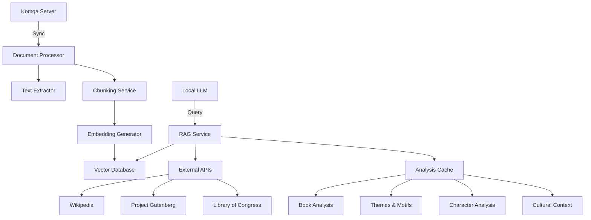

# Advanced RAG & AI Analysis for Komga

## Table of Contents
1. [Architecture Overview](#architecture-overview)
2. [Local LLM Integration](#local-llm-integration)
3. [Document Processing Pipeline](#document-processing-pipeline)
4. [Vector Database Setup](#vector-database-setup)
5. [RAG Implementation](#rag-implementation)
6. [Advanced Book Analysis](#advanced-book-analysis)
7. [Integration with Komga](#integration-with-komga)
8. [Performance Optimization](#performance-optimization)
9. [Security & Privacy](#security--privacy)
10. [Deployment Guide](#deployment-guide)

## Architecture Overview



## Local LLM Integration

### 1. Ollama Setup

```bash
# Install Ollama
curl -fsSL https://ollama.ai/install.sh | sh

# Pull models
ollama pull llama3:8b-instruct-q4_K_M
ollama pull mistral:latest
ollama pull nomic-embed-text

# Start Ollama service
sudo systemctl enable ollama
sudo systemctl start ollama
```

### 2. LM Studio Configuration

```json
{
  "model": "TheBloke/Llama-3-8B-Instruct-GGUF",
  "model_file": "llama-3-8b-instruct.Q4_K_M.gguf",
  "context_length": 8192,
  "gpu_layers": 35,
  "threads": 8,
  "batch_size": 512,
  "temperature": 0.7,
  "top_p": 0.9,
  "max_tokens": 4096,
  "stop": ["<|eot_id|>", "<|end_of_text|>"]
}
```

### 3. vLLM Server

```python
# vllm_server.py
from vllm import LLM, SamplingParams

llm = LLM(
    model="TheBloke/Llama-3-8B-Instruct-GGUF",
    download_dir="./models",
    tensor_parallel_size=1,
    gpu_memory_utilization=0.9,
    max_model_len=8192
)

sampling_params = SamplingParams(
    temperature=0.7,
    top_p=0.9,
    max_tokens=4096,
    stop=["<|eot_id|>", "<|end_of_text|>"]
)

def generate(prompt):
    outputs = llm.generate(prompt, sampling_params)
    return outputs[0].outputs[0].text
```

## Document Processing Pipeline

### 1. Text Extraction

```python
import textract
import fitz  # PyMuPDF
from bs4 import BeautifulSoup
import ebooklib
from ebooklib import epub

class TextExtractor:
    @staticmethod
    def extract_text(file_path):
        if file_path.endswith('.pdf'):
            return TextExtractor._extract_pdf(file_path)
        elif file_path.endswith('.epub'):
            return TextExtractor._extract_epub(file_path)
        else:
            return textract.process(file_path).decode('utf-8')
    
    @staticmethod
    def _extract_pdf(file_path):
        text = ""
        with fitz.open(file_path) as doc:
            for page in doc:
                text += page.get_text()
        return text
    
    @staticmethod
    def _extract_epub(file_path):
        book = epub.read_epub(file_path)
        text = []
        for item in book.get_items():
            if item.get_type() == ebooklib.ITEM_DOCUMENT:
                soup = BeautifulSoup(item.get_content(), 'html.parser')
                text.append(soup.get_text())
        return '\n'.join(text)
```

### 2. Chunking Strategy

```python
from langchain.text_splitter import RecursiveCharacterTextSplitter
from typing import List, Dict, Any
import hashlib

class DocumentChunker:
    def __init__(self, chunk_size=1000, chunk_overlap=200):
        self.splitter = RecursiveCharacterTextSplitter(
            chunk_size=chunk_size,
            chunk_overlap=chunk_overlap,
            length_function=len,
            add_start_index=True
        )
    
    def chunk_document(self, text: str, metadata: Dict[str, Any]) -> List[Dict[str, Any]]:
        chunks = []
        chunks_with_meta = self.splitter.create_documents([text])
        
        for i, chunk in enumerate(chunks_with_meta):
            chunk_id = hashlib.md5(chunk.page_content.encode()).hexdigest()
            chunks.append({
                "id": chunk_id,
                "text": chunk.page_content,
                "chunk_number": i,
                "total_chunks": len(chunks_with_meta),
                "metadata": {
                    **metadata,
                    "start_index": chunk.metadata.get('start_index', 0)
                }
            })
        return chunks
```

## Vector Database Setup

### 1. ChromaDB Configuration

```python
import chromadb
from chromadb.config import Settings

class VectorStore:
    def __init__(self, persist_directory="./chroma_db"):
        self.client = chromadb.Client(Settings(
            chroma_db_impl="duckdb+parquet",
            persist_directory=persist_directory,
            anonymized_telemetry=False
        ))
        
        # Create or get collection
        self.collection = self.client.get_or_create_collection(
            name="book_chunks",
            metadata={"hnsw:space": "cosine"}
        )
    
    def add_documents(self, chunks: List[Dict[str, Any]]):
        """Add document chunks to the vector store"""
        if not chunks:
            return
            
        ids = [chunk["id"] for chunk in chunks]
        documents = [chunk["text"] for chunk in chunks]
        metadatas = [chunk["metadata"] for chunk in chunks]
        
        self.collection.add(
            documents=documents,
            metadatas=metadatas,
            ids=ids
        )
    
    def search(self, query: str, n_results: int = 5, filter_metadata: Dict = None):
        """Search for similar chunks"""
        return self.collection.query(
            query_texts=[query],
            n_results=n_results,
            where=filter_metadata
        )
```

### 2. Embedding Generation

```python
import numpy as np
from typing import List
import requests

class EmbeddingGenerator:
    def __init__(self, model_name="nomic-ai/nomic-embed-text-v1.5", api_base="http://localhost:11434"):
        self.model_name = model_name
        self.api_base = api_base
    
    def get_embeddings(self, texts: List[str]) -> List[List[float]]:
        """Get embeddings from local Ollama server"""
        embeddings = []
        for text in texts:
            response = requests.post(
                f"{self.api_base}/api/embeddings",
                json={"model": self.model_name, "prompt": text}
            )
            embeddings.append(response.json()["embedding"])
        return embeddings
    
    def get_embedding(self, text: str) -> List[float]:
        """Get a single embedding"""
        return self.get_embeddings([text])[0]
```

## RAG Implementation

### 1. Retrieval-Augmented Generation

```python
from typing import List, Dict, Any
import json

class RAGSystem:
    def __init__(self, vector_store, llm_service, embedding_service):
        self.vector_store = vector_store
        self.llm = llm_service
        self.embedding = embedding_service
        
    def retrieve(self, query: str, book_id: str = None, n_results: int = 5) -> List[Dict]:
        """Retrieve relevant chunks from the vector store"""
        filter_metadata = {"book_id": book_id} if book_id else None
        results = self.vector_store.search(
            query=query,
            n_results=n_results,
            filter_metadata=filter_metadata
        )
        return results
    
    def generate(self, query: str, context: List[str], system_prompt: str = None) -> str:
        """Generate response using LLM with context"""
        context_str = "\n\n".join([f"[Context {i+1}]\n{chunk}" for i, chunk in enumerate(context)])
        
        prompt = f"""{system_prompt or "You are a helpful AI assistant. Use the following context to answer the question."}

Context:
{context_str}

Question: {query}

Answer:"""
        
        return self.llm.generate(prompt)
    
    def rag_query(self, query: str, book_id: str = None, n_results: int = 5) -> Dict[str, Any]:
        """End-to-end RAG query"""
        # Retrieve relevant chunks
        retrieval_results = self.retrieve(query, book_id, n_results)
        
        # Extract text from results
        context_chunks = [doc["document"] for doc in retrieval_results["documents"][0]]
        
        # Generate response
        response = self.generate(query, context_chunks)
        
        return {
            "query": query,
            "response": response,
            "sources": [
                {
                    "text": doc["document"],
                    "metadata": doc["metadata"]
                } for doc in retrieval_results["documents"][0]
            ]
        }
```

## Advanced Book Analysis

### 1. Thematic Analysis

```python
class ThematicAnalyzer:
    def __init__(self, rag_system):
        self.rag = rag_system
    
    def analyze_themes(self, book_id: str) -> Dict:
        """Analyze major themes in a book"""
        prompt = """Identify and explain the 3-5 major themes in this book. 
For each theme, provide:
1. The theme name
2. A brief description
3. 2-3 key passages that illustrate this theme

Format your response as JSON."""
        
        response = self.rag.rag_query(prompt, book_id=book_id, n_results=10)
        return json.loads(response["response"])
    
    def compare_themes(self, book1_id: str, book2_id: str) -> Dict:
        """Compare themes between two books"""
        prompt = """Compare and contrast the themes in these two books. 
Identify:
1. Common themes
2. Unique themes in each book
3. How similar themes are treated differently

Format your response as JSON."""
        
        # Get chunks from both books
        results1 = self.rag.retrieve("themes and motifs", book_id=book1_id, n_results=5)
        results2 = self.rag.retrieve("themes and motifs", book_id=book2_id, n_results=5)
        
        context = [
            f"Book 1 Excerpts:\n{chr(10).join([doc['document'] for doc in results1['documents'][0]])}",
            f"Book 2 Excerpts:\n{chr(10).join([doc['document'] for doc in results2['documents'][0]])}"
        ]
        
        response = self.rag.generate(prompt, context)
        return json.loads(response)
```

### 2. Character Analysis

```python
class CharacterAnalyzer:
    def __init__(self, rag_system):
        self.rag = rag_system
    
    def identify_characters(self, book_id: str) -> List[Dict]:
        """Identify and analyze characters in a book"""
        prompt = """Identify the main characters in this book. For each character, provide:
1. Character name
2. Role in the story
3. Key traits and characteristics
4. Relationships with other characters
5. Character development arc

Format your response as JSON."""
        
        response = self.rag.rag_query(prompt, book_id=book_id, n_results=15)
        return json.loads(response["response"])
    
    def analyze_character_arc(self, book_id: str, character_name: str) -> Dict:
        """Analyze a character's development throughout the book"""
        prompt = f"""Analyze the character arc of {character_name} in this book. Include:
1. Initial introduction and first impressions
2. Key development moments
3. How they change throughout the story
4. Final state and resolution of their arc
5. Key quotes that illustrate their development

Format your response as JSON."""
        
        response = self.rag.rag_query(prompt, book_id=book_id, n_results=10)
        return json.loads(response["response"])
```

## Integration with Komga

### 1. API Endpoints

```kotlin
@RestController
@RequestMapping("/api/v1/ai")
class AIController(
    private val ragService: RAGService,
    private val analysisService: BookAnalysisService
) {
    @PostMapping("/query")
    fun queryBook(
        @RequestParam bookId: String,
        @RequestBody query: String
    ): ResponseEntity<Map<String, Any>> {
        val result = ragService.query(bookId, query)
        return ResponseEntity.ok(result)
    }
    
    @GetMapping("/{bookId}/analysis")
    fun analyzeBook(@PathVariable bookId: String): ResponseEntity<BookAnalysis> {
        val analysis = analysisService.analyzeBook(bookId)
        return ResponseEntity.ok(analysis)
    }
    
    @PostMapping("/compare")
    fun compareBooks(
        @RequestParam bookId1: String,
        @RequestParam bookId2: String
    ): ResponseEntity<ComparisonResult> {
        val result = analysisService.compareBooks(bookId1, bookId2)
        return ResponseEntity.ok(result)
    }
}
```

### 2. Background Processing

```kotlin
@Service
class BookProcessingService(
    private val taskScheduler: TaskScheduler,
    private val textExtractor: TextExtractor,
    private val documentChunker: DocumentChunker,
    private val vectorStore: VectorStore,
    private val embeddingService: EmbeddingService
) {
    private val logger = LoggerFactory.getLogger(javaClass)
    
    @Async
    fun processNewBook(book: Book) {
        try {
            // 1. Extract text
            val text = textExtractor.extractText(book.filePath)
            
            // 2. Chunk document
            val chunks = documentChunker.chunkDocument(
                text = text,
                metadata = mapOf(
                    "book_id" to book.id,
                    "title" to book.title,
                    "author" to book.author,
                    "publication_year" to book.publicationYear
                )
            )
            
            // 3. Generate embeddings
            val texts = chunks.map { it["text"] as String }
            val embeddings = embeddingService.getEmbeddings(texts)
            
            // 4. Store in vector database
            chunks.forEachIndexed { index, chunk ->
                vectorStore.addDocument(
                    id = "${book.id}_$index",
                    text = chunk["text"] as String,
                    embedding = embeddings[index],
                    metadata = chunk["metadata"] as Map<String, Any>
                )
            }
            
            logger.info("Processed book ${book.id} into ${chunks.size} chunks")
            
        } catch (e: Exception) {
            logger.error("Error processing book ${book.id}", e)
            throw e
        }
    }
}
```

## Performance Optimization

### 1. Caching Strategy

```python
from functools import lru_cache
from datetime import datetime, timedelta
from typing import Dict, Any
import json

class AnalysisCache:
    def __init__(self, max_size=1000, ttl_hours=24):
        self.cache = {}
        self.max_size = max_size
        self.ttl = timedelta(hours=ttl_hours)
    
    def _get_key(self, book_id: str, analysis_type: str) -> str:
        return f"{book_id}:{analysis_type}"
    
    def get(self, book_id: str, analysis_type: str) -> Dict[str, Any]:
        key = self._get_key(book_id, analysis_type)
        if key not in self.cache:
            return None
            
        entry = self.cache[key]
        if datetime.now() - entry["timestamp"] > self.ttl:
            del self.cache[key]
            return None
            
        return entry["data"]
    
    def set(self, book_id: str, analysis_type: str, data: Dict[str, Any]):
        if len(self.cache) >= self.max_size:
            # Remove oldest entries first
            oldest_key = min(self.cache.keys(), 
                           key=lambda k: self.cache[k]["timestamp"])
            del self.cache[oldest_key]
            
        key = self._get_key(book_id, analysis_type)
        self.cache[key] = {
            "data": data,
            "timestamp": datetime.now()
        }
    
    @lru_cache(maxsize=1000)
    def get_cached_analysis(self, book_id: str, analysis_type: str) -> Dict[str, Any]:
        """LRU cache for frequently accessed analyses"""
        return self.get(book_id, analysis_type)
```

### 2. Batch Processing

```python
from concurrent.futures import ThreadPoolExecutor, as_completed
from typing import List, Dict, Any, Callable

class BatchProcessor:
    def __init__(self, max_workers=4):
        self.executor = ThreadPoolExecutor(max_workers=max_workers)
    
    def process_batch(
        self, 
        items: List[Any], 
        process_fn: Callable,
        batch_size: int = 10,
        **kwargs
    ) -> List[Any]:
        """Process items in batches with parallel execution"""
        results = []
        
        for i in range(0, len(items), batch_size):
            batch = items[i:i + batch_size]
            futures = [
                self.executor.submit(process_fn, item, **kwargs)
                for item in batch
            ]
            
            for future in as_completed(futures):
                try:
                    result = future.result()
                    results.append(result)
                except Exception as e:
                    print(f"Error processing item: {e}")
        
        return results
```

## Security & Privacy

### 1. Data Protection

```python
from cryptography.fernet import Fernet
import os

class DataProtection:
    def __init__(self, key=None):
        self.key = key or os.getenv('ENCRYPTION_KEY')
        if not self.key:
            self.key = Fernet.generate_key().decode()
        self.cipher_suite = Fernet(self.key)
    
    def encrypt_text(self, text: str) -> str:
        """Encrypt sensitive text"""
        if not text:
            return ""
        return self.cipher_suite.encrypt(text.encode()).decode()
    
    def decrypt_text(self, encrypted_text: str) -> str:
        """Decrypt sensitive text"""
        if not encrypted_text:
            return ""
        return self.cipher_suite.decrypt(encrypted_text.encode()).decode()
    
    def secure_book_processing(self, book_path: str) -> str:
        """Process book with security measures"""
        # 1. Verify file integrity
        if not self._verify_file_integrity(book_path):
            raise SecurityError("File integrity check failed")
        
        # 2. Process in secure environment
        text = self._process_in_sandbox(book_path)
        
        # 3. Sanitize output
        return self._sanitize_text(text)
    
    def _verify_file_integrity(self, file_path: str) -> bool:
        # Implementation for file integrity check
        return True
    
    def _process_in_sandbox(self, file_path: str) -> str:
        # Implementation for secure processing
        return ""
    
    def _sanitize_text(self, text: str) -> str:
        # Implementation for text sanitization
        return text
```

## Deployment Guide

### 1. Docker Compose Setup

```yaml
version: '3.8'

services:
  komga:
    image: gotson/komga:latest
    ports:
      - "8080:8080"
    volumes:
      - ./data/komga:/config
      - /path/to/books:/books
    environment:
      - SPRING_PROFILES_ACTIVE=prod
      - KOMGA_CONFIG_HOME=/config
    restart: unless-stopped

  ollama:
    image: ollama/ollama:latest
    ports:
      - "11434:11434"
    volumes:
      - ollama_data:/root/.ollama
    restart: unless-stopped

  chromadb:
    image: chromadb/chroma:latest
    ports:
      - "8000:8000"
    volumes:
      - chroma_data:/chroma/chroma
    environment:
      - CHROMA_SERVER_AUTH_CREDENTIALS=admin:admin
      - CHROMA_SERVER_AUTH_CREDENTIALS_PROVIDER=chromadb.auth.token_authn.TokenAuthServerProvider
      - CHROMA_SERVER_AUTH_PROVIDER=chromadb.auth.token_authn.TokenAuthServerProvider
    restart: unless-stopped

  rag_service:
    build: ./rag-service
    ports:
      - "5000:5000"
    environment:
      - OLLAMA_BASE_URL=http://ollama:11434
      - CHROMA_SERVER_URL=http://chromadb:8000
      - CHROMA_AUTH_TOKEN=admin
    depends_on:
      - ollama
      - chromadb
    restart: unless-stopped

volumes:
  ollama_data:
  chroma_data:
```

### 2. Kubernetes Deployment

```yaml
# rag-deployment.yaml
apiVersion: apps/v1
kind: Deployment
metadata:
  name: rag-service
  labels:
    app: rag-service
spec:
  replicas: 3
  selector:
    matchLabels:
      app: rag-service
  template:
    metadata:
      labels:
        app: rag-service
    spec:
      containers:
      - name: rag-service
        image: your-registry/rag-service:latest
        ports:
        - containerPort: 5000
        env:
        - name: OLLAMA_BASE_URL
          value: "http://ollama:11434"
        - name: CHROMA_SERVER_URL
          value: "http://chroma:8000"
        resources:
          requests:
            memory: "2Gi"
            cpu: "1000m"
          limits:
            memory: "4Gi"
            cpu: "2000m"
---
apiVersion: v1
kind: Service
metadata:
  name: rag-service
spec:
  selector:
    app: rag-service
  ports:
  - port: 80
    targetPort: 5000
  type: ClusterIP
```

### 3. Monitoring and Logging

```yaml
# prometheus-config.yaml
apiVersion: monitoring.coreos.com/v1
kind: ServiceMonitor
metadata:
  name: rag-service-monitor
  labels:
    release: prometheus
spec:
  selector:
    matchLabels:
      app: rag-service
  endpoints:
  - port: metrics
    interval: 15s
    path: /metrics
```

## Conclusion

This implementation provides a comprehensive RAG system for Komga that enables deep analysis of book content using local LLMs. The system is designed to be:

1. **Private**: All processing happens locally
2. **Extensible**: Easy to add new analysis modules
3. **Scalable**: Can handle large libraries
4. **Integrable**: Works with existing Komga infrastructure

## Next Steps

1. **Performance Testing**: Benchmark with different LLM models
2. **User Interface**: Build Komga plugin for the analysis features
3. **Fine-tuning**: Fine-tune models on book analysis tasks
4. **Community Models**: Allow users to contribute analysis models
5. **Feedback Loop**: Implement user feedback to improve analysis quality
